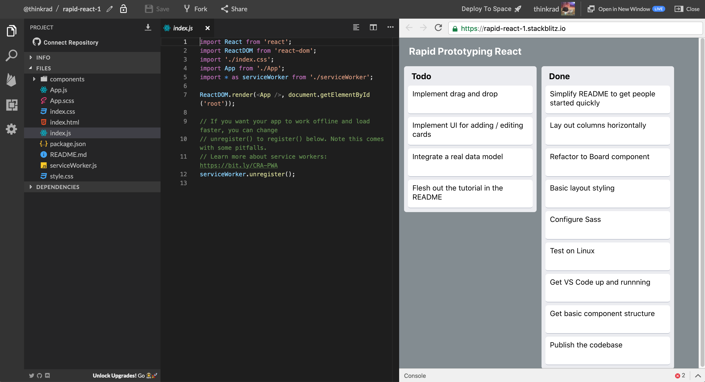

# Rapid React: Step 1 - Setting Up

_This page is part of a <a href="https://link.lavell.xyz/rapid-react" target="_blank">Step-by-Step Tutorial</a> 
to build a <a href="http://trello.com/" target="_blank">Trello</a> clone in <a href="http://reactjs.org/" target="_blank">React</a>._

<a href="https://link.lavell.xyz/rapid-react-demo" target="_blank">_Click here to run the Demo of the Complete Prototype_</a>

## Introduction

This tutorial aims to provide a solid introduction to app prototpying
and development, with as few pre-requisites as possible. 

## What is React?

React is a JavaScript library for building user interfaces. It lets you
 compose complex UIs from small and isolated pieces of code called 
 **components**. 
 
 React is designed around rapid iteration, where
 changes you make to the code are quickly refreshed and displayed back
 to you. This will enable you to build out your ideas
 more quickly and reliably, then having to constantly wait around long
 build times with opaque tools (especially when working on UI, which
 is inherently visual).

 ## Pre-Requisites

### Web Development

Having a working knowledge of HTML, CSS and JS will definitely help
you get going on this tutorial. There are **so** many introductory
resources out there, of varying quality - it can be hard to cut
through the noise.

I highly recommend [Learn to Code HTML and CSS by Shay Howe](https://learn.shayhowe.com/html-css/).
It covers the basics in an accessible manner, and goes on to 
more advanced topics as well.

### Basic Programming Knowledge

Also required is a basic working knowledge of how programs operate - 
i.e. what is a function, what is a variable, etc. 

I've tried to make this tutorial as accessible as possible, even to 
complete beginners, but I recognize a need for an even more basic 
pre-reqs tutorial for those just starting. Possibly in the future I will
make that as well! 

## Checkpoints

Each step will contain links to multiple "Checkpoints", which are 
self-contained development environments that allow you to edit and 
run the code, right in your browser. Each checkpoint will contain the
code up to that point in the tutorial - so, if you're following along,
you can make sure your coding matches up to mine. Or, if you get lost,
just start from that most recent checkpoint, and you'll be fine!

## Development Tool

To get you up and running with minimal fuss, this tutorial will use an
online coding environment, [StackBlitz](https://stackblitz.com), which lets you write and run
your code in real-time on your web browser. That also makes this tutorial
cross-platform - try it on Linux, macOS or even Windows.

 On the left, you have the 
project files. In the middle, the code editing pane. And on the right,
the live-reloading result of your React endeavors.

[Try poking around the Development Environment for the Completed Prototype](https://link.lavell.xyz/rapid-react-dev-final)

## You're Good to Go!

Go to [Step 2 - Introduction to Components](https://link.lavell.xyz/rapid-react-2)