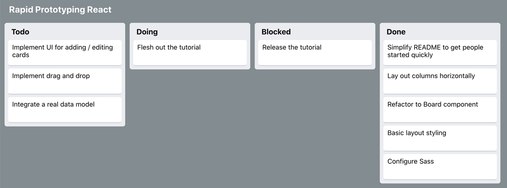

# Rapid React: Step 2 - Introduction to Components

_This page is part of a <a href="https://link.lavell.xyz/rapid-react" target="_blank">Step-by-Step Tutorial</a> 
to build a <a href="http://trello.com/" target="_blank">Trello</a> clone in <a href="http://reactjs.org/" target="_blank">React</a>._

<a href="https://link.lavell.xyz/rapid-react-demo" target="_blank"></a>

<a href="https://link.lavell.xyz/rapid-react-demo" target="_blank">_Click here to run the Demo of the Complete Prototype_</a>

## Pre-Requisites

Make sure you've completed <a href="https://link.lavell.xyz/rapid-react-1" target="_blank">Step 1</a>, which will explain how the development environments work, and help you brush up on Javascript / web technologies.

## Follow Along in Code

<a href="https://link.lavell.xyz/rapid-react-dev-2" target="_blank">Step 2 Development Environment</a>

## What is a Component?

When designing a program, it is helpful to break it down into modular units that fit
together to make a greater whole. This is true not just in UIs, but across the 
range of types of things a program might try to model. React's focus on components makes this concept easy to put into practice. 

To define a React Component, you need:

* A set of parameters that get passed to the component, called **props**
* A **render** method which tells React how to draw the component

Components can be defined as **classes** or **functions**. For now, we are
going to define our components as functions, as that is the simplest possible
form!

## Breaking Trello into Components

Let's start at the conceptual level. We can analyze Trello and break 
it down into a set of components:

* **Cards**, which contain the text for tasks


* **Lists**, which contain sequences of Cards


* **Boards**, which contain sequences of Lists


  
Simple structure, right? Trello has even
more concepts, like **Users**, **Organizations**, and **Powerups** for
example - but we are only going to focus on core components. This is
a prototype, not a full-fledged product!

## Creating Components in React

Okay! Enough theory. It's time to code. 

If you haven't already, open up the <a href="https://link.lavell.xyz/rapid-react-dev-2" target="_blank">Development Environment</a>. Mouse
over the _Files_ pane on the left-hand side, and click _New File_. Name
it **Card.js**, and type in the following code: 

```javascript
import React from 'react';

function Card(props) {
  return (
    <div className="Card"> 
      {props.title}
    </div>
  );
}

export default Card;
```

Now, go to **App.js**, and add the following line at the top of the file,
after the other imports:

```javascript
import Card from './Card.js';
```

In the main ```App()``` function, in the ```<div>``` tag, add the following:

```javascript
<Card title="Learn to code" />
<Card title="Do a flip" />
<Card title="Go outside" />
```

You should see the app auto-reload on the right side of the screen,
displaying each of your cards in order, without any fancy formatting -
just text!

You've just created the basis of a data model for your app. Good work!
Might not look like much, but there's a lot of flexibility and future
potential in this little island of code. 

Your code should now match this: <a href="https://link.lavell.xyz/rapid-react-dev-2-1" target="_blank">Step 2 - Checkpoint 1</a>

_Feel free to just open from this checkpoint if you're having issues
getting the code running and don't want to get stuck debuggig right now._

## Under the Hood

Okay, so _what_ did we just do, exactly?

This section will go over all of the key puzzle pieces to understand
what just happened.

xyz