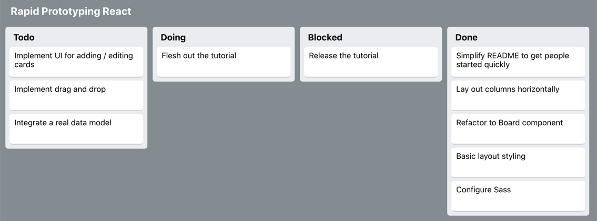

# Rapid React: Step 3 - Styling with CSS

_This page is part of a <a href="https://link.lavell.xyz/rapid-react" target="_blank">Step-by-Step Tutorial</a> 
to build a <a href="http://trello.com/" target="_blank">Trello</a> clone in <a href="http://reactjs.org/" target="_blank">React</a>._

<a href="https://link.lavell.xyz/rapid-react-demo" target="_blank"></a>

<a href="https://link.lavell.xyz/rapid-react-demo" target="_blank">_Click here to run the Demo of the Complete Prototype_</a>

## Pre-Requisites

Make sure you've completed <a href="https://link.lavell.xyz/rapid-react-2" target="_blank">Step 2</a>, which got the basic structure 
for our Trello board up and running.

## Follow Along in Code

<a href="https://link.lavell.xyz/rapid-react-3-0" target="_blank">Step 3 Development Environment</a>

## Getting Started

So, you've got a _very_ basic setup on your hands, that has an internal
representation of the **Card** and **List** data structures, 
which render the Cards as elements of a ```<ul>```. There's no styling,
however!

### CSS

If you've done any amount of web development before, you've come across
Cascading Style Sheets (CSS). CSS is a language for defining the 
aesthetic of the visible aspects of a webpage - or in our case, a
web **app**.

If you have little or no experience in CSS, I recommend checking out
[Getting to Know CSS](https://learn.shayhowe.com/html-css/getting-to-know-css/)
from Shay Howe's Learn to Code HTML and CSS.

## Setting the Stage

Open up the Development Environment for this step.


Pop open **App.css**, and change the background color of the body.

```css
body {
  background-color: #838c91;
}
```

I'm using the Hex value from one of Trello's (limited) color options.
Setting the background color to grey will allow us to see more clearly
what we're doing with the Card and List styling.


