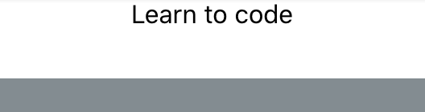

# Rapid React: Step 3 - Styling with CSS

_This page is part of a <a href="https://link.lavell.xyz/rapid-react" target="_blank">Step-by-Step Tutorial</a> 
to build a <a href="http://trello.com/" target="_blank">Trello</a> clone in <a href="http://reactjs.org/" target="_blank">React</a>._

<a href="https://link.lavell.xyz/rapid-react-demo" target="_blank"></a>

<a href="https://link.lavell.xyz/rapid-react-demo" target="_blank">_Click here to run the Demo of the Complete Prototype_</a>

## Pre-Requisites

Make sure you've completed <a href="https://link.lavell.xyz/rapid-react-1" target="_blank">Step 2</a>, which got the basic structure 
for our Trello board up and running.

## Follow Along in Code

<a href="https://link.lavell.xyz/rapid-react-dev-2" target="_blank">Step 3 Development Environment</a>

## Getting Started

So, you've got a _very_ basic setup on your hands, that has an internal
representation of the **Card** data structure, and a simple rendering
of the Cards as plaintext in a column. Cool, from a programmer's point
of  view - but not quite a working prototype! Time to remedy that.

### CSS

If you've done any amount of web development before, you've come across
Cascading Style Sheets (CSS). CSS is a language for defining the 
aesthetic of the visible aspects of a webpage - or in our case, a
web **app**.

If you have little or no experience in CSS, I recommend checking out
[Getting to Know CSS](https://learn.shayhowe.com/html-css/getting-to-know-css/)
from Shay Howe's Learn to Code HTML and CSS.

## Setting the Stage

Open up the Development Environment for this step.


Pop open **App.css**, and change the background color of the body.

```css
body {
  background-color: #838c91;
}
```

I'm using the Hex value from one of Trello's (limited) color options.
Setting the background color to grey will allow us to see more clearly
what we're doing with the Card's styling.

## Styling the Card Component

We are going to focus exclusively on styling the Card component
for the next little bit. To facilitate this focus, let's cut the list
of Cards from 3 down to 1 in App.js:

```javascript
function App() {
  return (
    <div className="App">
      <Card title="Learn to code" />
    </div>
  );
}
```

Now, create a new file, and call it **Card.css**. Type in the following:

```css
.Card {
  background-color: white; 
  width: 270px;
  height: 50px;
}
```

In order to see the changes on the Card,
you will need to reference the **CSS class** you just created, from
the Card's JSX. To do so, add ```className="Card"``` to the ```<div>```
tag. 


```javascript
function Card(props) {
  return (
    <div className="Card"> 
      {props.title}
    </div>
  );
}
```

_Note: Don't confuse CSS classes with JS classes! They have the same 
name, but are not the same thing._

You should now see that the Card has black text on a white background,
contrasted against the grey background of the full page. 



Comparing to how Cards look in Trello, there's still plenty of 
adjustments to make.


The text should be aligned to the left, rather than centred.

```css
text-align: left
```


